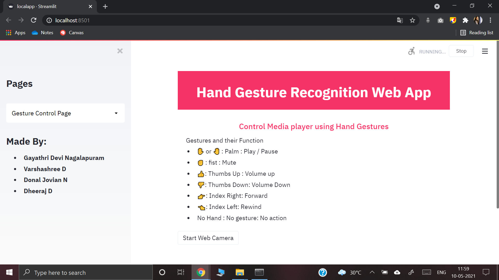
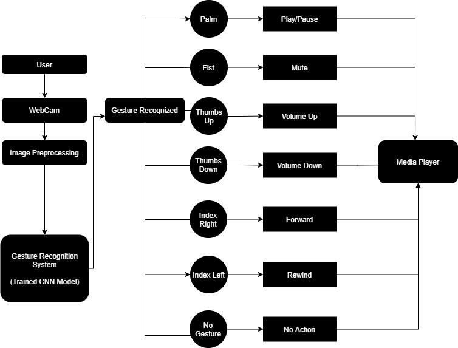
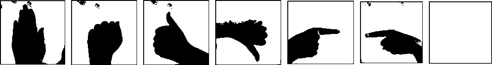
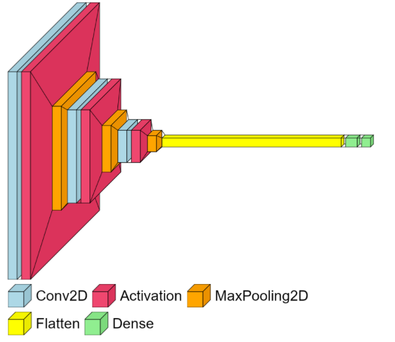
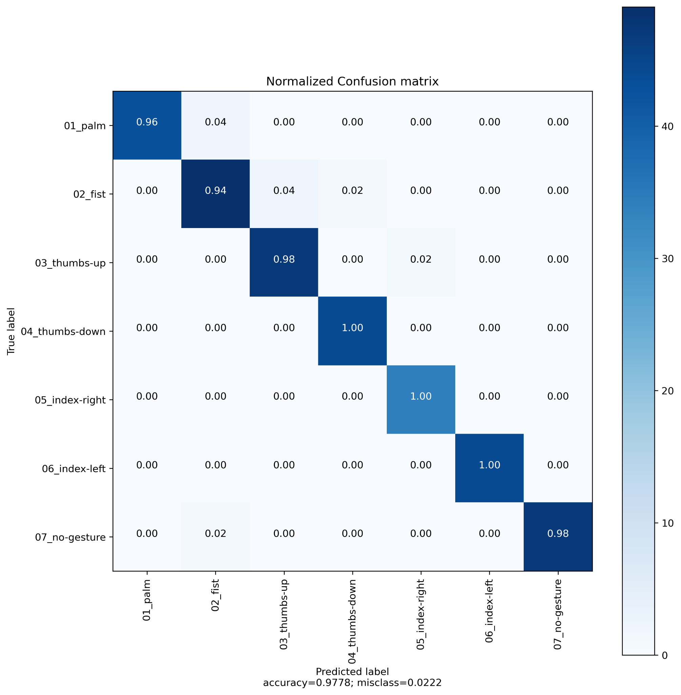

# Controlling Media Player with Hand Gestures using Convolutional Neural Network

## Kindly go through our Research Paper published by IEEE on this project for more information and cite it in your projects
## https://ieeexplore.ieee.org/document/9641567

### A Web Application to control media player using Hand gestures (Using Streamlit)

The primary aim is to use the most natural form, i.e., hand gestures to interact with the computer system. The goal of this project is to create a web application that uses your device's camera to give you touch-free and remote-free control over any media player application (with no special hardware). It would implement these gestures such that they are easy to perform, fast, efficient, and ensure an immediate response. It increases your productivity and makes your life easier and comfortable by letting you control your device from a distance.

The proposed system can control the media player from a distance using hand gestures. 
1. OpenCV is used to collect raw images and convert them to black and white images for dataset creation. 
2. Two Dimensional Convolutional Neural Network is built for feature extraction and classification.
3. The PyAutoGUI library is used to integrate the Keyboard keys to hand gestures 
4. A user interface is created using the Streamlit web framework 
5. A webpage is deployed which contains source files and demo using streamlit.io sharing.

#### Web App link: 

https://share.streamlit.io/gayathri1462/hand-gesture-recognition-streamlit/main/webapp.py

#### System Design Flow: 

#### Data collection and preprocessing using OpenCV: 

**Gestures obtained after Data collection and preprocessing**:
Palm, fist, thumbs up, thumbs down, index pointing right, index pointing left and no gesture (Left to right)

#### Architecture of trained CNN model: 

#### Results: 

#### Performance Evalutaion:

